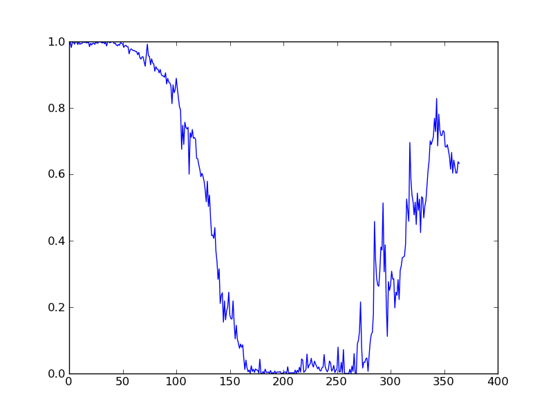
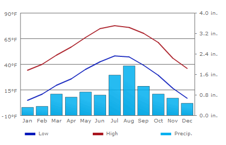
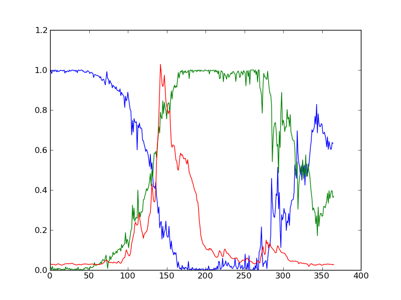
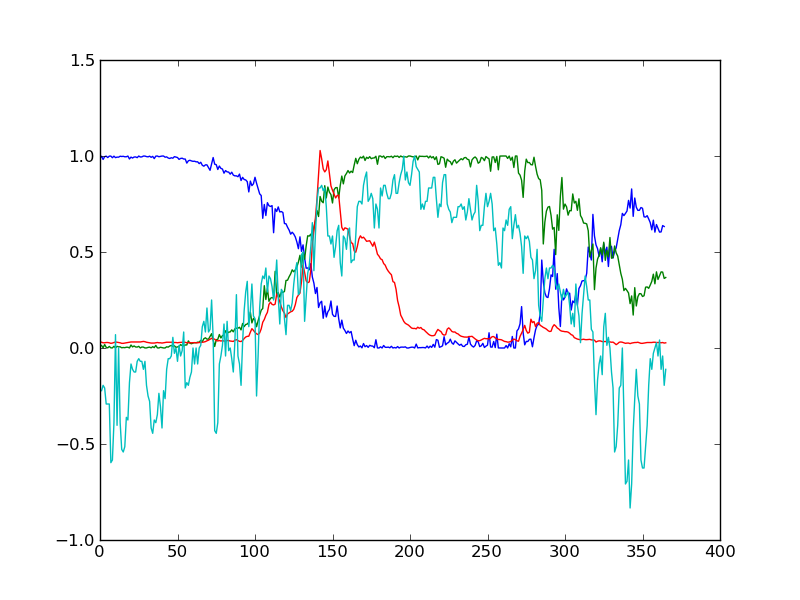
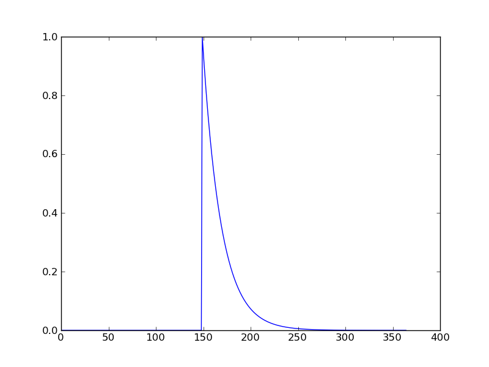
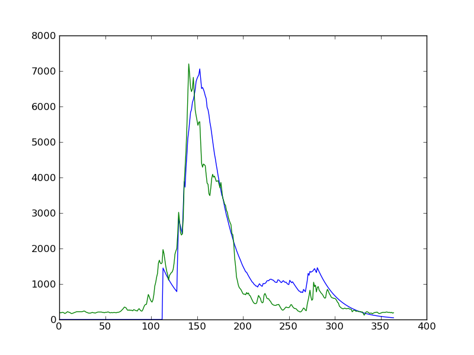

Rio Grande Headwaters
=====================

This practical concerns building a snowe mely model for part of the Rio Grande catchment in Colorado. There are many `references <http://www.google.co.uk/search?q=snow+model+rio+grande&ie=utf-8&oe=utf-8&aq=t&rls=org.mozilla:en-US:official&client=firefox-a>`_ on this subject.

In a previous exercise, you should have developed a snow dataset over the Rio Grande Headwaters (HUC catchment 13010001) for the year 2005. 

This should look something like:

Where we can see that the area is almost completely snow covered in January and February, followed by a steady decrease in snow cover.

Backup dataset
--------------

If for any reason, you were unable to generate this dataset, you can load a copy from `snowDatas.npz <python/snowDatas.npz>`_. Note that *if* you do use this dataset, you need to note the fact in your write-up. If you use this dataset and fail to attribute it, that is plagiarism.

You should not suppose that this is better than anything you might have generated yourself. It is here *only* to allow students unable to get a working copy of the first practical to get on with the rest of the exercise.

If you do need to use tehse data, you should load it as in this example::

    import numpy as np
    x = np.load('snowDatas.npz')
    sub = x['sub']
    snow = x['snow']
    mask = x['mask']

Here, the variable `sub` indicates `(start x, end x, start y, end y)` image coordinates that the dataset representes (i.e. we have cut out just the data around the catchment). The variable `mask` is a 2D numpy array set to 1 for the catchment area and 0 elsewhere. The variable `snow` is a 3D dataset. The last two dimensions are the same as the mask. The first dimension is time (day of year).

The snow dataset is derived from the MODIS daily snow product. An interpolation scheme is applied per pixel to filter out samples missing due to cloud etc. If you use this dataset, you still need to calculate the average proportion of snow coiver on each day (remember to use the mask!).

Backup 2
--------

If you are still completely stuck, we have included a version of the snow proportion dataset. If you use this, you won't have completed the first part of the assignment, but you will be able to still work on the second part and hopefully pick up marks there.

The dataset is available as `snowprop.npz <python/snowprop.npz>`_. Remember that if you do use this version for your snow proportion data, you must say so in your report. If you do not attribute it in this way, that is plagiarism.

To use this dataset::

    import numpy as np
    snowProp = np.load('snowprop.npz')['snowProp']

The variable `snowProp` is a 1D numpy array, of size 365, representing the proportion of snow cover for each day of the year (in 2005).

Building a hydrological model
-----------------------------

What we are going to do is to build a hydrological model, driven by data in the Rio Grande Headwaters. The purpose of the model is to describe the streamflow at the Del Norte measurement station, just on the edge of the catchment.

The average climate for Del Norte is:

Further general information is available from various `websites <http://www.usclimatedata.com/climate.php?location=USCO0103>`_, including `NOAA <http://www4.ncdc.noaa.gov/cgi-win/wwcgi.dll?wwDI~StnSrch~StnID~10100138>`_.

You can visualise the site `here <http://mesonet.agron.iastate.edu/sites/site.php?station=CO2184&network=COCLIMATE>`_.

First then, we should look at the streamflow data.

Here:

we have plotted the streamflow (scaled) in red, the snow cover in blue, and the non snow cover in green. It should be apparent that thge hydrology is snow melt dominated, and to describe this (i.e. to build the simplest possible model) we can probably just apply some time lag function to the snow cover.

We will return to this below, but before doing that, we give you access to the hydrological data, in the file `delnorte.dat <python/delnorte.dat>`_. This dataset is available through `http://waterdata.usgs.gov`. The top part of the file shows:

.. literalinclude:: python/delnorte.dat
    :lines: 1-40

The columns we are interested in are: column 3 (date field) and column 4 (daily discharge, cubic feet per second). You will need to work out a way of reading the data from this file into an array. You will probably find it most convenient to translate from the date format given to day of year.

One way to do this is e.g.::

   import datetime
   ds = [2005,10,30]
   doy = datetime.datetime(ds[0],ds[1],ds[2]).strftime('%j')
   print doy
   303

Note that in this work, we only want the data for one particular year, so, in reading the data you should aim to produce an array with 365 elements giving the dailyt streamflow for that year (so, it would then be the same size as the snow dataset).

Temperature data
----------------

We can directly access `temperature data from here <http://ccc.atmos.colostate.edu/cgi-bin/dlydb.pl?yrbeg=2005&yrend=2005&station=52184+DEL+NORTE&proc=2+-+List+Format+%28see+docs%29>`_.

The format of `delNorteT.dat <python/delNorteT.dat>`_ is given `here <http://ccc.atmos.colostate.edu/readme.html>`_.

The first three fields are date fields, followed by TMAX, TMIN, PRCP, SNOW, SNDP.   

You should read in the temperature data. For temperature, you might take a mean of TMAX and TMIN. Note that these are in Fahrenheit. You should convert them to 
Celcius.

Note also that there are missing data (values 9998 and 9999). You will need to filter these and interpolate the data in some way. A median might be a good approach, but any interpolation will suffice.

With that processing then, you should have a dataset, `Temperature` that will look something like:

Modelling delay in a hydrological network
-----------------------------------------

The basis of a model is going to be something of the form::

    SWE = k * snowProportion        
   
 
where `SWE` is the 'snow water equivalent', the amount of snow in the entire snow pack in the catchment. 
`snowProportion` here then, is the proportion of snow cover in the catchment. We lump together density and area terms into the coefficient `k`.

The simplest model of snowmelt is one where we assume that a proportion of this SWE is released as a function of temperature.
In its simplest form, this is simply a temperature threshold::

    meltDays = np.where(temperature > tempThresh)[0]
    
On these `melt days` then, we release K * snowProportion of water into the system. For the present, we will ignore direct precipitation. So::

    for d in meltDays:
        water = K * snowProportion[d]

Here, `K` is a different coefficient which will be a function of `k` above and the snow depth. We assume that all properties are constant over the catchment.

Now we have a mechanism to release snow melt into the catchment, but there will always be some delay in the water reaching the monitoring station from far away regions, compared to nearby areas. The function that describes this delay can be called a `network response function <http://www.google.co.uk/search?q=network+response+function&ie=utf-8&oe=utf-8&aq=t&rls=org.mozilla:en-US:official&client=firefox-a#sclient=psy-ab&hl=en&client=firefox-a&hs=qgI&rls=org.mozilla:en-US%3Aofficial&source=hp&q=network+response+function+hydrology&pbx=1&oq=network+response+function+hydrology&aq=f&aqi=&aql=&gs_sm=e&gs_upl=2213l4483l0l4547l10l9l0l0l0l0l226l961l6.2.1l9l0&bav=on.2,or.r_gc.r_pw.r_cp.,cf.osb&fp=d48ede2c1f2a6462&biw=1098&bih=673>`_. It is often modelled as a Laplace function (an exponential). The idea is that if we have a 'flash' input to the catchment, this network response function will give us what we would measure as a hydrograph at the monitoring station (or elsewhere). 

We can parameterise this with a decay factor, `p`, so that if the amount of water on day d is 1, the amount on day d+1 is p, on d+2, p^2 etc::

    n = np.arange(len(snowProportion)) - d
    m = p ** n
    m[np.where(n<0)]=0

so here, `m` is the decay function:

for the day 150. This model will transfer a large amount of water of the peak day, then less and less as time goes by.
So, a simple model then is of the form::

    tempThresh = 9.0
    K = 2000.0
    p = 0.96
    meltDays = np.where(temperature > tempThresh)[0]
    accum = snowProportion*0.
    for d in meltDays:
        water = K * snowProportion[d]
        n = np.arange(len(snowProportion)) - d
        m = p ** n
        m[np.where(n<0)]=0
        accum += m * water

This is a *very* simple model. It has three parameters (tempThresh, K, p) and id driven only by temperature and snow cover data. And yet, we see that even with a rough guess at what the parameters ought to be, we can get a reasonable match with the observed flow data:

Of course the reason for this is that we already saw a good match between the snow cover data and the flow data, so we wouldn't expect to need a complex model to describe it.

Assessed Exercise: Part 2 (of 3)
--------------------------------

Your second task for the assessed practical then, is to develop a simple hydrological model capable of describing the observed flow data. There are many clues to help you do this in this section, and we even provide most of the python code that you would need to implement this.

You should run and test the code using appropriate climate data and snow cover data for HUC catchment 13010001.

Your code should include a function that can be called with *an array* of parameter values (so, it would contain tempThresh, K, and p if you follow the example above). This function must be capable of calculating the predicted flow data (i.e. accum here).

Your code should include another function that calculates the mismatch between the modelled flow data (accum here) and the observed data.

You should explore and describe what the impact of the model parameters is, giving some relevant values of mismatch and graphs.

If you have been unable to complete the first part of the practical, you should proceed with this section, using the data provided above, then revisit the snow proportion calculation later if time allows.

There are many ways in which this model could be criticised, so do try to think through all of the assumptions that are being made in developing a model of this sort. If you have time, try to develop some modifications to the model that might improve operation, but be careful not to put too many new parameters into it. Also think through what the uses of such a model might be.
