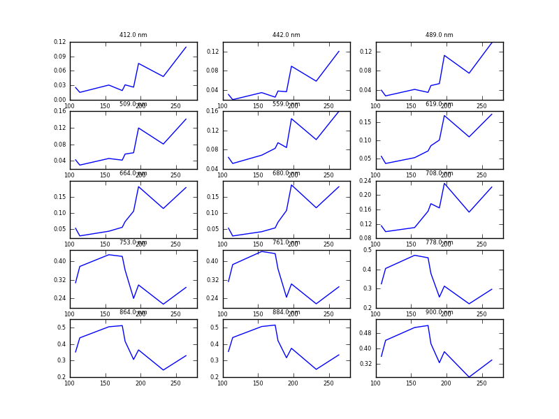
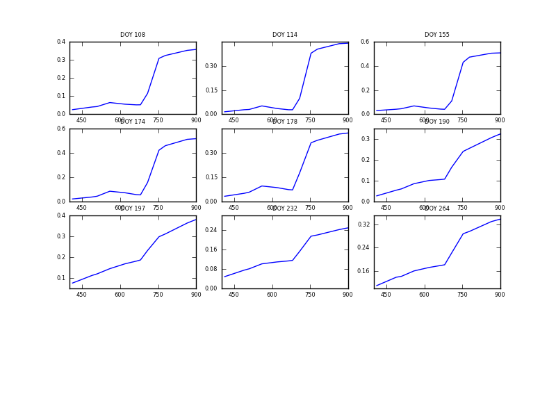

Classes
=======

Introduction
------------

In this session we will introduce the concept of classes in python, to allow us to develop a model class that includes the ability to estimate the parameters, plot results etc.

Building a class
----------------

If we first consider some common task, such as reading some data from an ASCII file, we can easily write some python code to achieve this, and, as we have seen,conveniently write this in a function. 

For example, consider an ASCII file containg lines of MERIS reflectance data for different dates, `meris/MERIS_WG_1_C_1.brf <meris/MERIS_WG_1_C_1.brf>`_:

.. literalinclude:: meris/MERIS_WG_1_C_1.brf

The file has a one line header, specifying 

.. csv-table::
    :header: Name,e.g.

  
    Magic Number,#BRDF
    mask,1 or 0
    n samples,9
    n bands,15
    waveband 1,412
    waveband 2,442
    ...
    sd band 1,0.01
    sd band 2,0.01
     ...

so we can read this information with, e.g.:

::

    import numpy as np
    import sys
        
    def read(filename):
        '''
        Read data from file and store reflectance 
        and associated control data
        '''
        try:
            data = np.loadtxt(filename,unpack=True)
            header = open(filename).readline().split()[1:]
        except:
            print >> sys.stderr,'Error reading file %s'%filename
            return
        # pull out parts of the data
        doy = data[0,:]
        mask = data[1,:]
        vza = data[2,:]
        vaa = data[3,:]
        sza = data[4,:]
        saa = data[5,:]
        nbands = int(header[1])
        bands = np.array([float(i) for i in header[2:2+nbands]])
        err = np.array([float(i) for i in header[2+nbands:]])
        reflectance = data[6:6+nbands,:] 
        nsamples = data.shape[1]
        return nsamples,nbands,reflectance,bands,doy,mask,vza,vaa,sza,saa,err
    
    file = 'meris/MERIS_WG_1_C_1.brf'
    nsamples,nbands,reflectance,bands,doy,mask,vza,vaa,sza,saa,err = read(file)
    print nsamples,nbands
    

::

    9 15
    

Note that we have used a `try` statement in here. This makes the code somewhat robust to errors as, if either of the statements on the following lines failes, we will fall through to the exception, where we print an error message and return from the function.

We can test this:

::

    read('a file that doesnt exist')
    

Whlst this provides a potentially re-useable piece of code for reading this sort of data, the number of items we output is quite large once we have unpacked the infornation, and the calling of the function rather awkward then. Further, we would probably want to keep all of this information together in some way, rather than losing track of parts of it. One way to do that would be using a dictionary.

Do that now. 

Task 1
~~~~~~

Re-phrase the function above, so that it returns the information that we want as a dictionary, so that we get a single return value from a call to `read(file)`.

Without even doing any real operations on the data, we might decide that we want to develop a plotting function to visualise these data. Again, we could write a convenient function for this:

::

    import pylab as plt
    
    def plot(x,y,titles=None,outfile=None):
        '''
        Plot y as fn of x
    
        Both x and y can be lists, in which case we plot multiple datasets
        '''
        x = list(x)
        y = list(y)
        if len(x) != len(y):
            self.__error("incompatile x and y send to %s"%str(self.plot))
            return
        if y[0].ndim > 1:
            nterms = y[0].shape[0]
            nplots1 = int(np.round(np.sqrt(nterms)*4./3.))
            nplots2 = int(nterms/nplots1+0.5)
            if nplots1*nplots2 < nterms:
                nplots2 += 1
        else:
            nplots1 = nplots2 = nterms =1
    
        plt.clf()
        # set some plotting size info
        plt.rcParams.update(\
                {'axes.labelsize':5,\
                 'text.fontsize': 6, \
                 'xtick.labelsize': 6,\
                 'ytick.labelsize': 6})
        # now loop over all nterms
        for i in xrange(nterms):
            ax = plt.subplot(nplots1,nplots2,i+1)
            for j in xrange(len(x)):
                if y[j].ndim > 1:
                    plt.plot(x[j],y[j][i,:])
                else:
                    plt.plot(x[j],y[j])
            if titles:
                try:
                    plt.title(titles[i],{'fontsize':6})
                except:
                    pass
            ax.yaxis.set_major_locator(plt.MaxNLocator(4))
            ax.xaxis.set_major_locator(plt.MaxNLocator(4))
        if outfile:
            plt.savefig(outfile)
        else:
            plt.show()
    
    def plot_doy(doy,reflectance,nbands,bands,outfile=None):
        '''
        Plot of reflectance as a function of DOY for each waveband
        '''
        x = [doy]
        y = [reflectance]
        titles = ['%.1f nm'%i for i in bands]
        plot(x,y,titles=titles,outfile=outfile)
        return
    
    
    plot_doy(doy,reflectance,nbands,bands,outfile='meris/plotterDoy.png')
    

Again, the information passing here is rather awkward.

Task 2
~~~~~~

As above, rephrase the function `plot_doy` to be passed all of the information it needs (other than perhaps `outfile`)) as a dictionary.

Task 3
~~~~~~

Based on what is in `plot_doy`, create a function to do a series of subplots of the spectral data for each sample day, i.e. each subplot should now be reflectance as a function of wavelength.

Creating a class
----------------

In many ways, it would be appropriate at this point to make use of a class for containing the data and methods that we have defined so far. A class is an organised collection of such items that we can use to simplify the interface to any user of the code and treat as an object. If we design our class well, we can also use the base classes for many other things (we can inherit useful things from this class).

You should make sure that you read the python `documentation on classes <http://docs.python.org/tutorial/classes.html>`_ but we will go through some examples now.

Let's start by defining a base class for BRF data. All we want it to do at the moment is to contain the finformation we have been putting in a dictionary above (i.e. reflectance, doy, mask, etc.) and to have some core methods that operate on these data. At the moment, these will be just reading in, writing out, and plotting (various styles).

::

    import numpy as np
    import pylab as plt
    
    class brdf:
        '''
        A class to represent brdf data and provide core functionality.
    
        Requires: numpy and pylab
    
        P. Lewis, UCL, 25 Nov. 2011
    
        '''
        def __init__(self):
            '''
            Class initialisation:
            zeros self.nsamples,self.nbands
            '''
            self.nsamples = 0
            self.nbands = 0
    
    

To start with then, we simply define a class initialiser `__init__(self)`. This is a special method that is called when we set up (create an instance of) the class:

::

    this = brdf()
    print this.nsamples, this.nbands
    help(this)
    

::

    0 0
    Help on instance of brdf in module __builtin__:
    
    class brdf
     |  A class to represent brdf data and provide core functionality.
     |  
     |  Requires: numpy and pylab
     |  
     |  P. Lewis, UCL, 25 Nov. 2011
     |  
     |  Methods defined here:
     |  
     |  __init__(self)
     |      Class initialisation:
     |      zeros self.nsamples,self.nbands
    
    

We note how the method `__init__` that belongs to the class `brdf` is indented. We also note how we place documentation for the class and each method, and how we have access to this information when we get help on the class.

We should also note the use of `self` to refer to the class itself.

So far then, other than documentation, this isn't very different to setting up `nsamples` and `nbands` in a dictionary (in fact, in lots of ways it isn't very different), though instead of referring to `this['nsamples']`, we use `this.nsamples`, which is a simpler notation. Lets now put the other functions we have developed into the class, as well as something to write data out:

::

    import numpy as np
    import pylab as plt
    import sys
    
    class brdf:
        '''
        A class to represent brdf data and provide core functionality.
    
        Requires: numpy and pylab
        
        P. Lewis, UCL, 25 Nov. 2011
    
        '''
        def __init__(self,ipfile=None):
            '''
                Class initialisation
            '''
            self.nsamples = 0
            self.nbands = 0
            if ipfile:
                self.read(ipfile)
    
        def read(self,filename):
            '''
            Read data from file and store reflectance
            and associated control data
    
            '''
            self.ipfile = filename
            try:
               data = np.loadtxt(filename,unpack=True)
               header = open(filename).readline().split()[1:]
            except:
                self.__error('Unable to read file %s in %s'%(filename,str(self.read)))
                return
            # pull out parts of the data
            self.doy = data[0,:]
            self.mask = data[1,:]
            self.vza = data[2,:]
            self.vaa = data[3,:]
            self.sza = data[4,:]
            self.saa = data[5,:]
            self.nbands = int(header[1])
            self.bands = np.array([float(i) for i in header[2:2+self.nbands]])
            self.err = np.array([float(i) for i in header[2+self.nbands:]])
            self.reflectance = data[6:6+self.nbands,:]
            self.nsamples = data.shape[1]
            self.data = data
            self.header = header
            return
    
        def __error(self,msg):
            '''
            Print an error message (private)
            '''
            print >> sys.stderr,msg
    
        def write(self,filename,reflectance=None):
            '''
            Write BRDF data to file.
    
            The reflectance data that we want to write to the files can
            be passed to this method, to override reflectance
    
            '''
            # we would like to write the output formatted.
            # The easiest way to do this is to use np.savetxt
            # which directly allows such things
            # But here, we want to put a header line in as well
            # so, we have to write the formamted output to
            # a tmp file with np.savetxt, then read it in, then put it
            # after the header in the file we wanted.
            # a bit of a pain, but maybe np.savetxt will have an option
            # to put a header in at some point
    
            import tempfile
            # what data to write out?
            if reflectance == None:
                reflectance = self.reflectance
    
            # stack all of the data up
            data = np.vstack((self.doy,self.mask,self.vza,self.vaa,\
                self.sza,self.saa,reflectance)).transpose()
            # try to open the file for read
            try:
                f = open(filename,'w')
            except:
                self.__error('Error writing file %s from %s'%(filename,str(self.write)))
                return
    
            # store the op filename used
            self.ofile = filename
        
            # set up header string: watch out for spacings and newline
            header = '#BRDF %d %d '%(int(self.nsamples),int(self.nbands))
            header += ' '.join([str(self.bands[i]) for i in xrange(self.nbands)])
            header += ' ' + ' '.join([str(self.err[i]) for i in xrange(self.nbands)])
    
            # write header to file
            f.write(header+'\n')
    
            # get a tmp filename
            ff2 = tempfile.NamedTemporaryFile()
    
            # write the data in formated form to tmp file
            np.savetxt(ff2.name,data,fmt=('%8.3f'))
    
            # read in the formatted data as lines & write straight after the header
            fa = open(ff2.name)
            ff2.close()
            f.writelines(fa.readlines())
    
            # close file
            f.close()
    
        def plot(self,x,y,titles=None,outfile=None):
            '''
            Plot y as fn of x
    
            Both x and y can be lists, in which case we plot multiple datasets
            '''
            x = list(x)
            y = list(y)
            if len(x) != len(y):
                self.__error("incompatile x and y send to %s"%str(self.plot))
                return
            if y[0].ndim > 1:
                nterms = y[0].shape[0]
                nplots1 = int(np.round(np.sqrt(nterms)*4./3.))
                nplots2 = int(nterms/nplots1+0.5)
                if nplots1*nplots2 < nterms:
                    nplots2 += 1
            else:
                nplots1 = nplots2 = nterms =1
    
            plt.clf()
            # set some plotting size info
            plt.rcParams.update(\
                {'axes.labelsize':5,\
                 'text.fontsize': 6, \
                 'xtick.labelsize': 6,\
                 'ytick.labelsize': 6})
            # now loop over all nterms
            for i in xrange(nterms):
                ax = plt.subplot(nplots1,nplots2,i+1)
                for j in xrange(len(x)):
                    if y[j].ndim > 1:
                        plt.plot(x[j],y[j][i,:])
                    else:
                        plt.plot(x[j],y[j])
                if titles:
                    try:
                        plt.title(titles[i],{'fontsize':6})
                    except:
                        pass
                ax.yaxis.set_major_locator(plt.MaxNLocator(4))
                ax.xaxis.set_major_locator(plt.MaxNLocator(4))
            if outfile:
                plt.savefig(outfile)
            else:
                plt.show()
    
        def plot_spectral(self,outfile=None):
            '''
            Spectral plot of reflectance for each DOY
            '''
            x = [self.bands]
            y = [self.reflectance.transpose()]
            titles = ['DOY %d'%i for i in self.doy]
            self.plot(x,y,titles=titles,outfile=outfile)
            return
    
        def plot_doy(self,outfile=None):
            '''
            Plot of reflectance as a function of DOY for each waveband
            '''
            x = [self.doy]
            y = [self.reflectance]
            titles = ['%.1f nm'%i for i in self.bands]
            self.plot(x,y,titles=titles,outfile=outfile)
            return
    

If we load a file and write the same data, we should get the same result as earlier.

::

    this = brdf(ipfile='meris/MERIS_WG_1_C_1.brf')
    this.write('meris/MERIS_WG_1_C_1_out.brf')
    
    

.. literalinclude:: meris/MERIS_WG_1_C_1_out.brf

::

    this.plot_spectral(outfile='meris/spectral.png')
    

Summary
-------

In this session, we have developed a few routines for reading and plotting BRDF data. We have seen how it is convenient to group the data and the methods that operate on them into a structure called a class. We have built a base class for handling BRDF data that can read data in ASCII format, write the data, and do several forms of plot.

The code for the brdf class is available `here <python/brdf.py>`_. The class help pages are:

::

    help(brdf)
    

::

    Help on class brdf in module __builtin__:
    
    class brdf
     |  A class to represent brdf data and provide core functionality.
     |  
     |  Requires: numpy and pylab
     |  
     |  P. Lewis, UCL, 25 Nov. 2011
     |  
     |  Methods defined here:
     |  
     |  __init__(self, ipfile=None)
     |      Class initialisation
     |  
     |  plot(self, x, y, titles=None, outfile=None)
     |      Plot y as fn of x
     |      
     |      Both x and y can be lists, in which case we plot multiple datasets
     |  
     |  plot_doy(self, outfile=None)
     |      Plot of reflectance as a function of DOY for each waveband
     |  
     |  plot_spectral(self, outfile=None)
     |      Spectral plot of reflectance for each DOY
     |  
     |  read(self, filename)
     |      Read data from file and store reflectance
     |      and associated control data
     |  
     |  write(self, filename, reflectance=None)
     |      Write BRDF data to file.
     |      
     |      The reflectance data that we want to write to the files can
     |      be passed to this method, to override reflectance
    
    

One last thing, whilst typing these notes, I found an issue with tabs and whitespece in my file. As a reminder on how to fix this::

sed 's/\\t/    /g' oldcode.py >newcode.py

