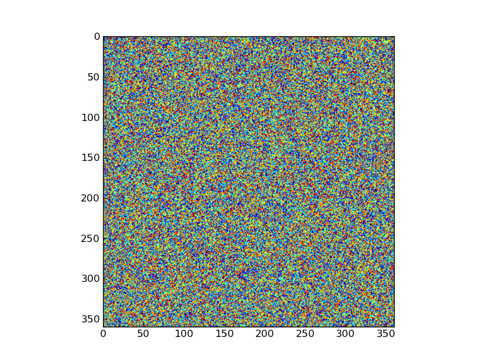
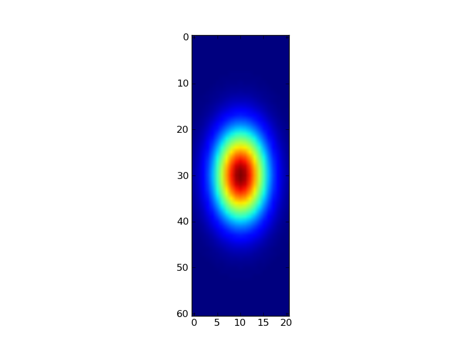
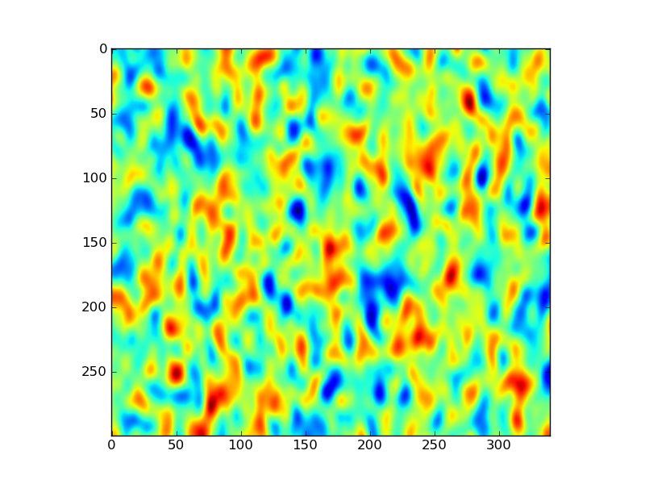
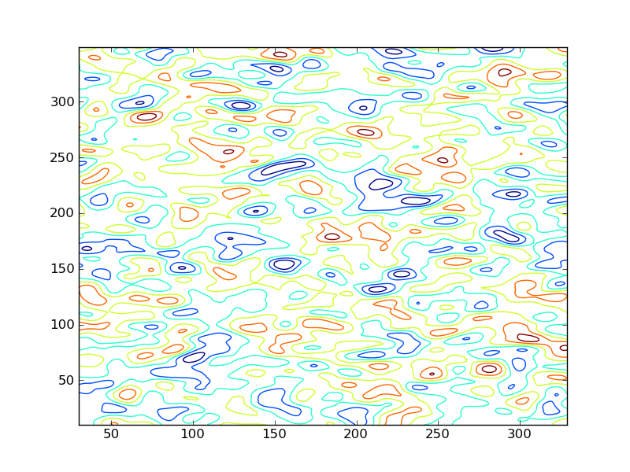
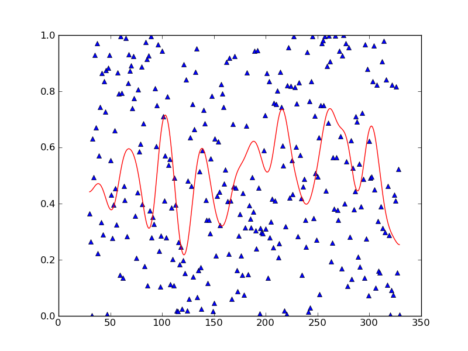
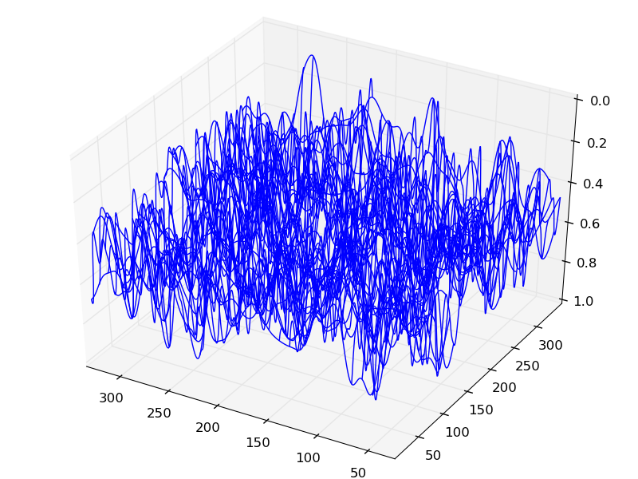
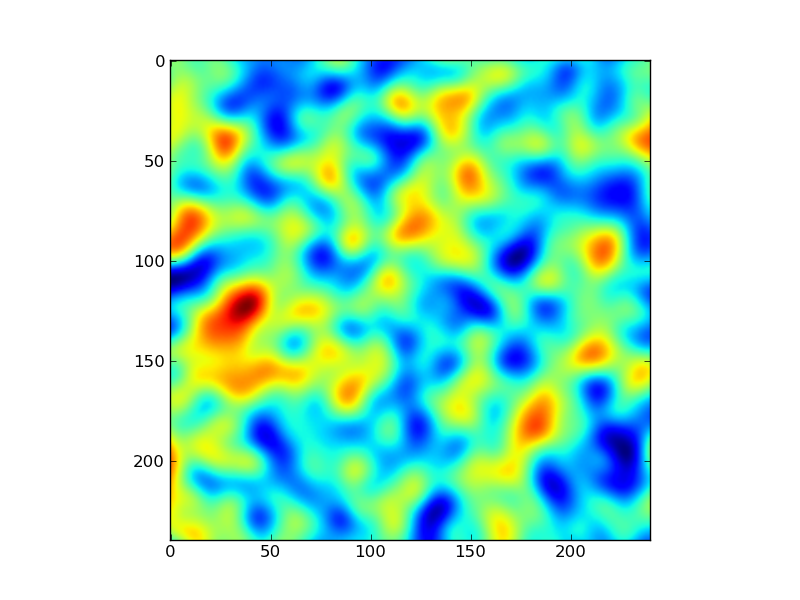

=======================================================
Numerical and Scientific Python and  Data Visualisation
=======================================================

Introduction
============

We have previously seen some of the main examples of the core data types in Python: `strings <python101.html?highlight=string#strings>`_ for text, `integer <python101.html?highlight=integer#integer>`_ and `float <python101.html?highlight=float#float>`_ for numerical representation; `boolean <python101.html?highlight=boolean#boolean>`_ for logical representation; and `dictionaries <python101.html?highlight=dict#dict>`_ and `lists <python101.html?highlight=list#lists>`_ as ways of grouping sets of (potentially different) data types together.

Very often in scientific programming, we wish to perform operations on sets containing the same data type, for instance vectors or matrices of floating point numbers. Of course we can use dictionaries or lists to do this, but they lack some of the general functionality we would normally need. The main package in Python for dealing with numerical manipulation then, is `numpy <http://numpy.scipy.org/>`_ which is often used together with `scipy <http://www.scipy.org/>`_. There are many resources built around these packages, and many tutorials available, such as `the one from scipy for numpy <http://www.scipy.org/Tentative_NumPy_Tutorial>`_ and the `scipy cookbook <http://www.scipy.org/Cookbook>`_.
A complete course in `Scientific Python <http://scipy-lectures.github.com/index.html>`_ is also available. It is up to you to make use of these various resources to back up what we cover in these classes, for further learning, and for general reference.

We strongly recommend that you go through some of these in your own time. At the very least, be aware that there are such resources to help you develop what you can do with these (and other) packages. 

Tools to enable you to visualise data are available in a number of packages, but one of the most common ones is `matplotlib <http://matplotlib.sourceforge.net/>`_ or the slightly different philosophy of `pylab <http://www.scipy.org/PyLab>`_. These have very good help pages, but to start with, you might find the `gallery of different examples <http://matplotlib.sourceforge.net/gallery.html>`_ most useful.

Anyone who has come across matlab before will notice a good deal of similarity between matplotlib (and indeed, elements of numpy) and matlab. Some of the advantages of using the Python packages over matlab are `given here <http://en.wikipedia.org/wiki/Matplotlib#Comparison_with_MATLAB>`_ but `there is much debate around these things <http://brenocon.com/blog/2009/02/comparison-of-data-analysis-packages-r-matlab-scipy-excel-sas-spss-stata/>`_ and of course there are many tools developed around matlab that you may wish to use at some point. One key advantage of the Python packages over matlab for many users is that it is open source, but another viable open source toolset for many of the things we will do here is `R <http://www.r-project.org/>`_. Rather than attempting to 'teach' you all of these tools and packages, it is preferable that we settle on one main one (Python and its packages here) and provide you pointers to how you might use what you learn here in other languages/tools. On the subject of R, we note here that there is a Python interface to R called `RPy <http://rpy.sourceforge.net/>`_.

To help appreciate some of the similarities and differences, and to help you transliterate between one language and another, there are several web resources that you might find useful, including `NumPy for Matlab Users <http://www.scipy.org/NumPy_for_Matlab_Users>`_, A 'crib sheet' covering basic equivalences between matlab/octave, python and R is `available as a pdf <http://www.google.co.uk/url?sa=t&source=web&cd=3&ved=0CDcQFjAC&url=http%3A%2F%2Fmathesaurus.sourceforge.net%2Fmatlab-python-xref.pdf&rct=j&q=matlab%20python&ei=Jft6TvPXM9Ka1AWm1b2jAw&usg=AFQjCNGmSeFre2HxLxev8ZX1DCfBeXgRSQ&sig2=-ysrvcJGr4ogqQDjlb7PLA&cad=rja>`_ , or a more general 'Mathesaurus' provided `here <http://mathesaurus.sourceforge.net/>`_.

An additional piece of software to consider and keep an eye on as it develops is `sage <http://sage.math.washington.edu/sage/>`_ which is a general open source mathematics software, with a Python-based interface.

In this session
---------------

In this session then, we will *not* attempt to take you through all of the features of scipy, numpy and matplotlib. Instead, we will develop some examples where we build simple environmental models that you can use. 

All of the above is, in one sense just context. What you *want* to be able to do is get on and write some useful code so that you can explore some interesting data or model. With that in mind, we will now develop some code for a simple environmental model.

We will also introduce the idea of methods, wher we group together sets of python commands to make new ones ... which is at the heart of any programming.

Random Digital Elevation Model
==============================

Introduction
------------

Here we will write a simple Python code to generate a 2D random correlated field which we will use to represent a DEM.
We will also demonstrate some features of ``numpy``, ``scipy`` and ``matplotlib``, and demonstrate spatial convolution in Python.

In particular:

  [`np.random.rand`_] [`plt.imshow`_] [`plt.show`_] [`matplotlib.pylab`_] [`np.mgrid`_] [`np.exp`_] [`np.shape`_] [`np.size`_] [`scipy.signal`_] [`scipy.signal.convolve`_] [`add_subplot`_] [`contour`_] [`plot`_] [`plt.figure`_] [`mpl_toolkits`_] [`mplot3d`_] [`axes3d`_] [`view_init`_] [`plot_wireframe`_] [`draw`_]

.. _np.random.rand:

Random DEM
----------

::

    #!/usr/bin/env python
    import numpy as np
    nx = 360
    ny = 360
    dem1 = np.random.rand(nx,ny)
    

We first import the numpy package but for convenience give it the local name ``np`` (``import numpy as np``). Next we set up two variables that we will use to represent the dimensions of the array (``nx`` and ``ny``). We then use the ``random.rand()`` method in numpy to generate the 2D random array. 

This is a bit big to use ``print`` with (though you could try), so we need some way of visualising it. We can do this using ``pylab``:

.. _plt.imshow:
.. _plt.show:
.. _matplotlib.pylab:

::

    import matplotlib.pylab as plt
    plt.imshow(dem1)
    plt.show()
    

   Figure 1. Random DEM

Filter
------

Next, we will 'smooth' the dataset with a convolution filter to induce correlation. To do this we must first generate a filter. For smoothing, we might choose a Gaussian filter, so we will need to apply a `Gaussian function <ihttp://mathworld.wolfram.com/GaussianFunction.html>`_ in 2D. To make this interesting, we will have a filter which is different dimensions in x and y:

.. _np.mgrid:
.. _np.exp:

::

    sizex = 30
    sizey = 10
    x, y = np.mgrid[-sizex:sizex+1, -sizey:sizey+1]
    g = np.exp(-0.333*(x**2/float(sizex)+y**2/float(sizey)))
    filter = g/g.sum()
    

`Here, np.mgrid <http://docs.scipy.org/doc/numpy/reference/generated/numpy.mgrid.html>`_ (see ``help(np.mgrid)``) generates an N-dimensional grid of *indices* in the ``numpy`` arrays ``x`` and ``y``:

.. _np.shape:
.. _np.size:

>>> print type(x)
<type 'numpy.ndarray'>
>>> print x.shape
(61, 21)
>>> print x.size
1281
>>> print x
[[-30 -30 -30 ..., -30 -30 -30]
 [-29 -29 -29 ..., -29 -29 -29]
 [-28 -28 -28 ..., -28 -28 -28]
 ..., 
 [ 28  28  28 ...,  28  28  28]
 [ 29  29  29 ...,  29  29  29]
 [ 30  30  30 ...,  30  30  30]]
>>> print y
[[-10  -9  -8 ...,   8   9  10]
 [-10  -9  -8 ...,   8   9  10]
 [-10  -9  -8 ...,   8   9  10]
 ..., 
 [-10  -9  -8 ...,   8   9  10]
 [-10  -9  -8 ...,   8   9  10]
 [-10  -9  -8 ...,   8   9  10]]

We have introduced a few useful methods here for examining numpy arrays. `Here, np.shape <http://docs.scipy.org/doc/numpy/reference/generated/numpy.ma.shape.html>`_ gives a `tuple <http://docs.python.org/release/1.5.1p1/tut/tuples.html>`_ giving the dimensions of the array ``x`` (similarly ``y`` of course). You should note that the range of numbers given in ``np.mgrid`` is *inclusive*, so the numbers here go from -30 to +30 (thence 61 entries). `We use np.size <http://docs.scipy.org/doc/numpy/reference/generated/numpy.ndarray.size.html>`_ to give the total number of elements in the array. We can also note how the ``print`` method works with printing arrays that are a bit big to show.

The `method np.exp <http://docs.scipy.org/doc/numpy/reference/generated/numpy.exp.html>`_ applies an exponential function to the arrays (N.B. ``x`` and ``y`` need to have the same shape to do this, otherwise you couldn't add them together with ``x**2/float(sizex)+y**2/float(sizey)``). This is a nice example of one of the features of using numpy: we can apply functions (methods) to *arrays*, so we do not have to loop over the array and apply it to each element. This makes for clearer code, but is also generally more efficient. The Gaussian function we have generated is scaled by 0.333 to avoid having too many zero values in the convolution array (spatial convolution in this way is quite expensive computationally) but there are dangers of `ringing <http://en.wikipedia.org/wiki/Ringing_%28signal%29>`_ if you cut the filter off too soon and leave sharp transitions more generally).

Finally in the code snippet, we normalise the Gaussian function so that it has an integral of unity. The method `np.sum() <ihttp://docs.scipy.org/doc/numpy/reference/generated/numpy.sum.html>`_ gives the sum of the elements in the array, so dividing by this will normalise the function.

We can visualise the filter we have generated:

::

    plt.imshow(filter)
    plt.show()
    

   Figure 2. Gaussian filter

Convolution
-----------

Now, we have a spatial dataset and a filter, so we want to `convolve <http://docs.gimp.org/en/plug-in-convmatrix.html>`_ one with the other. We can use the method convolve `in scipy.signal <http://docs.scipy.org/doc/scipy/reference/signal.html>`_:

.. _scipy.signal:
.. _scipy.signal.convolve:

::

    from scipy import signal
    demSmooth = signal.convolve(dem1,filter,mode='valid')
    # rescale so it lies between 0 and 1
    demSmooth = (demSmooth - demSmooth.min())/(demSmooth.max() - demSmooth.min())
    

We might now check the size of the output:

>>> print dem1.shape
(360, 360)
>>> print demSmooth.shape
(300, 340)

and visualise it with:

::

    plt.imshow(demSmooth)
    plt.show()
    

   Figure 3. Correlated Random DEM

We note that when we printed the size of the final 'smooth' DEM it was smaller. Use the help pages for ``scipy.signal.convolve`` and your understanding of convolution to appreciate why this is so and what the options might have been.

This random correlated field is now something that we could use to approximate a DEM. It has generally linear features running North-South because of the shape of the filter we applied, but other than that, plenty of little hills and valleys. Correlated random fields are useful for many applications, but here, we just want a pseudoDEM.

more Plotting
-------------

You should explore `matplotlib <http://matplotlib.sourceforge.net/>`_ and perhaps particularly the `gallery <http://matplotlib.sourceforge.net/gallery.html>`_ to begin with to work out how to produce some neater plots than the ones we have generated here.

We will however show a few quick examples:

First, some contours:

.. _add_subplot:
.. _contour:

::

    X,Y = np.mgrid[0:demSmooth.shape[0],0:demSmooth.shape[1]]
    X += sizex
    Y += sizey
    fig = plt.figure()
    ax = fig.add_subplot(111)
    ax.contour(X,Y,demSmooth)
    plt.show()
    

   Figure 4. Contours

Next, a slice through the DEM, showing the original data as well:

.. _plot:

::

    fig = plt.figure()
    ax = fig.add_subplot(111)
    demsub = dem1[sizex:-sizex,sizey:-sizey]
    ax.plot(X[:,X.shape[0]/2],demsub[:,X.shape[0]/2],'b^')
    ax.plot(X[:,X.shape[0]/2],demSmooth[:,X.shape[0]/2],'r')
    plt.show()
    

   Figure 5. Slice

Incidentally in this example, we show how to generate a subset of the data, generating ``demsub`` to match ``demSmooth``.

Finally, a 3D grid plot that might be good for visualising terrain:

.. _plt.figure:
.. _mpl_toolkits:
.. _mplot3d:
.. _axes3d:
.. _view_init:
.. _plot_wireframe:
.. _draw:

::

    from mpl_toolkits.mplot3d import axes3d
    fig = plt.figure()
    ax = axes3d.Axes3D(fig)
    ax.view_init(-141.,60.)
    ax.plot_wireframe(X, Y,demSmooth,cstride=10,rstride=10) 
    #plt.draw()
    plt.show()
    

   Figure 6. 3D wireframe

If you uncomment the ``plt.draw()`` line, you will be able to interact with the plot.

For more sophisticated 3D plotting, see `mayavi <http://code.enthought.com/projects/mayavi/>`_.

Methods
========

Now we understand a little of python data types and have used some of the functionality of some of the toolkits, we can think a bit more about how we should be writing computer codes.

One core concept in (almost) any coding language is the idea of methods (similar to subroutines and functions in some other languages). The idea here is that we can group together a set of commands into a method. When we want to do something with this set of commands, we then simply *call* the method. 

A method has some set of *arguments*, which are simply items that we pass to the method. For example, if we wanted to create a method to generate a gridded dataset, we could use:

.. plot::
    :include-source: 

    def randomGrid1(nx):
        '''
        Generate a random gridded dataset
        '''
        # import required libraries
        import numpy as np
        # generate the random field
        grid = np.random.rand(nx,nx)
        # return the dem
        return grid

    def gridPlotter1(grid,title):
        '''
        plot a gridded dataset
        with title 
        '''
        # import required libraries
        import matplotlib.pylab as plt
        plt.imshow(grid)
        plt.title(title)
        plt.show()

    # call it & plot
    n = 200
    dem = randomGrid1(n)
    gridPlotter1(dem,'random dem of size %d'%n)

Here, we have defined two methods: ``randomGrid1`` and ``gridPlotter1``. The method ``randomGrid1`` has one argument, ``nx`` which is a *local* variable within the method. The method ``gridPlotter1`` has two arguments: ``dem`` and ``title``. When we *call* ``gridPlotter1``, ``gridPlotter1(dem,'random dem of size %d'%n)``, the local variables ``dem`` and ``title`` take on the values of the items pointed to by the variables when we make the call. So, in the method, the variable ``grid`` takes the value (and data type) of ``dem`` and the variable ``title`` becomes the result of the string operation ``'random dem of size %d'%n``.

Note that in python we do not define the *type* of the argument variables. This makes the code very flexible, as we can define methods to work with multiple data types.

Another feature we notice from the above examples is the *help* strings for each method. In ``gridPlotter1``, the help text is ``plot a gridded dataset with title``. We will see how to use this later, but including such documentation is an important part of python coding.

Note that sometimes a method might return a value (or more than one value, if they are comma separated) and sometimes not.

Other than that, the methods we have used are just a sequential list of commands that we have used earlier. What is useful here though is that we have *grouped* these methods together to make a new method.

As well as arguments, we may wish to have some options for items that we might want to pass to a method, e.g.:

.. plot::
    :include-source: 

    def randomGrid2(nx,ny=None,scale=1.0,offset=0.0):
        '''
        Generate a random gridded dataset

          nx    : number of samples

        Options:
          ny    : number of rows (default, nx)
          scale : scaling applied to the random numbers
          offset: offset applied to the random numbers
 
        '''
        # import required libraries
        import numpy as np
        # generate the random field
        grid = np.random.rand(ny or nx,nx)*scale+offset
        # return the dem
        return grid

    def gridPlotter2(grid,title=None):
        '''
        Plot a gridded dataset

          grid  : 2D gridded dataset
 
        Options:
          title : plot title
  
        '''
        # import required libraries
        import matplotlib.pylab as plt
        plt.imshow(grid)
        plt.title(title)
        plt.show()

    # call it & plot
    nx = 200
    ny = 100
    dem = randomGrid2(nx,ny=ny)
    gridPlotter2(dem)
    help(randomGrid2)
    help(gridPlotter2)

The ``help`` calls produce the help (documentation) text:

::

    randomGrid2(nx, ny=None, scale=1.0, offset=0.0)
        Generate a random gridded dataset
    
          nx    : number of samples
    
        Options:
          ny    : number of rows (default, nx)
          scale : scaling applied to the random numbers
          offset: offset applied to the random numbers
    

and

::

    gridPlotter2(grid, title=None)
        Plot a gridded dataset
    
          grid  : 2D gridded dataset
    
        Options:
          title : plot title

Note how, when we *call* a method, we give the list of arguments first, and then any options.

Exercises
----------

Exercise
~~~~~~~~~

Modify the method ``gridPlotter2`` so that no title is plotted if the title option is not specified (i.e. if it is still the default value of ``None``).

Exercise
~~~~~~~

Write a method that will produce a random correlated field using a Gaussian smoothing filter of given dimensions.

**Hint** You have the code for a random uncorrelated method above. You need to generate the Gaussian filter within the method, then convolve this with the random field as in the examples above, and return the smoothed dem.

If you can't do this, an example implementation is given `here <python/smoothGrid.py>`_.

This should produce something like:

Generation of this page
========================

The code for this page is in `dem1.py <http://www2.geog.ucl.ac.uk/~plewis/geogg122/source/dem1.py>`_.

As an interesting aside, you might be interested to know that this tutorail page was generated using a tool called `Pweave <http://mpastell.com/pweave/index.html>`_ which executes the Python code examples here (and generates graphs etc.) as it forms the html (or pdf etc.) page you see here. It would be interesting for you to generate your coursework submissions using this, if you are prepared to put a little extra learning in. The main feature of this is a Python package called `Sphinx <http://sphinx.pocoo.org/>`_. If you are using your own computer, you can readily install these with::

    berlin% sudo easy_install -U Sphinx Pweave

The pweave text for this page is `here <http://www2.geog.ucl.ac.uk/~plewis/geogg122/source/dem1.Pnw>`_ and the `restructured text generated by pweave here <http://www2.geog.ucl.ac.uk/~plewis/geogg122/source/dem1.rst>`_.
