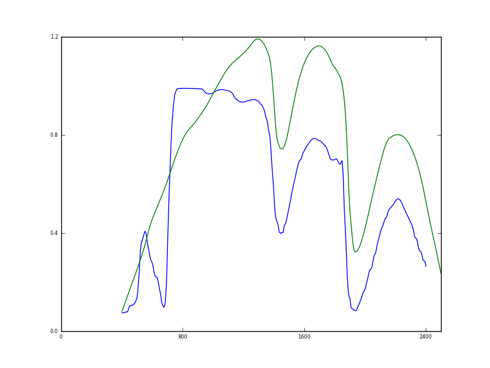
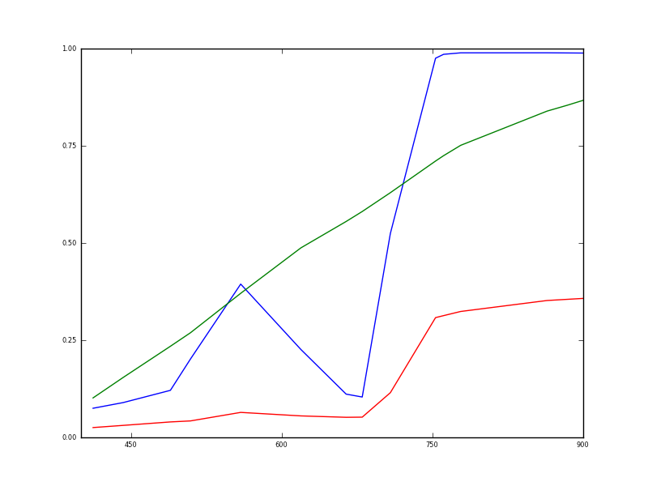
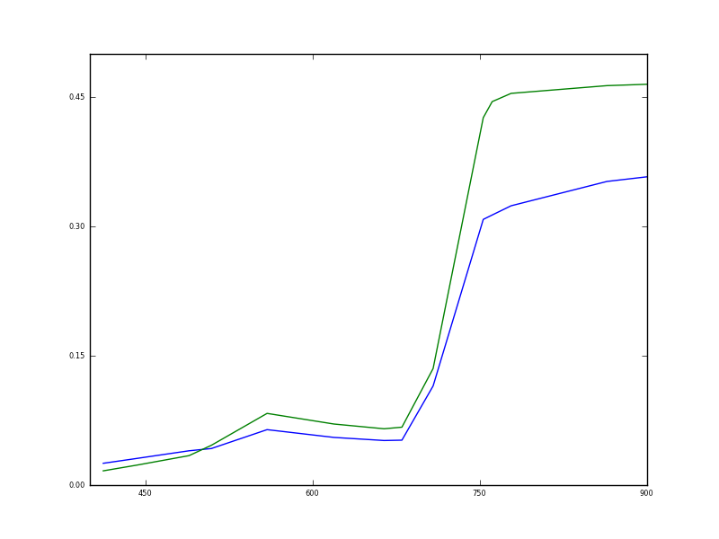
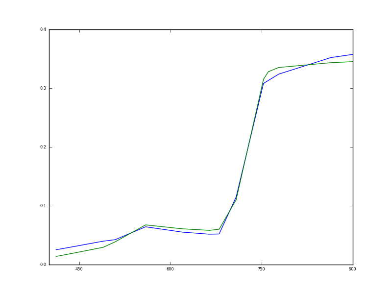
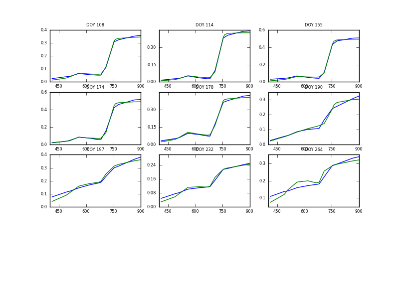
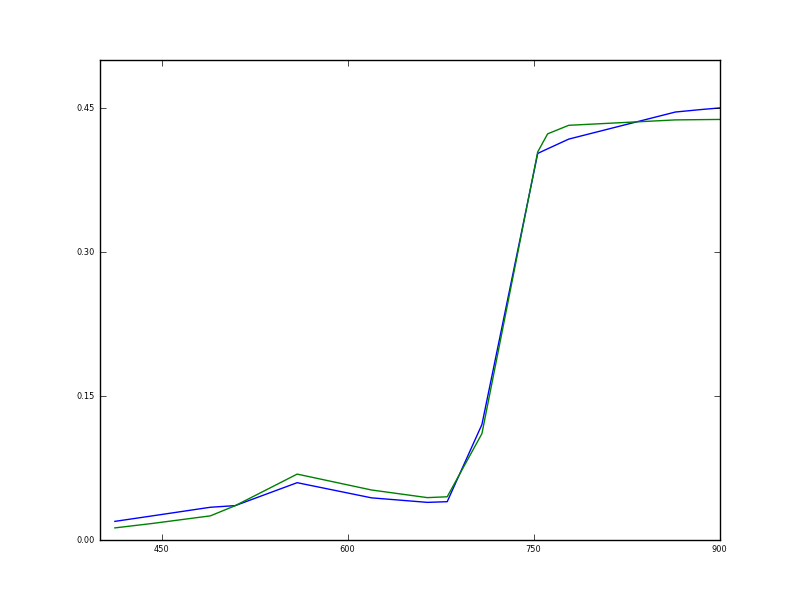
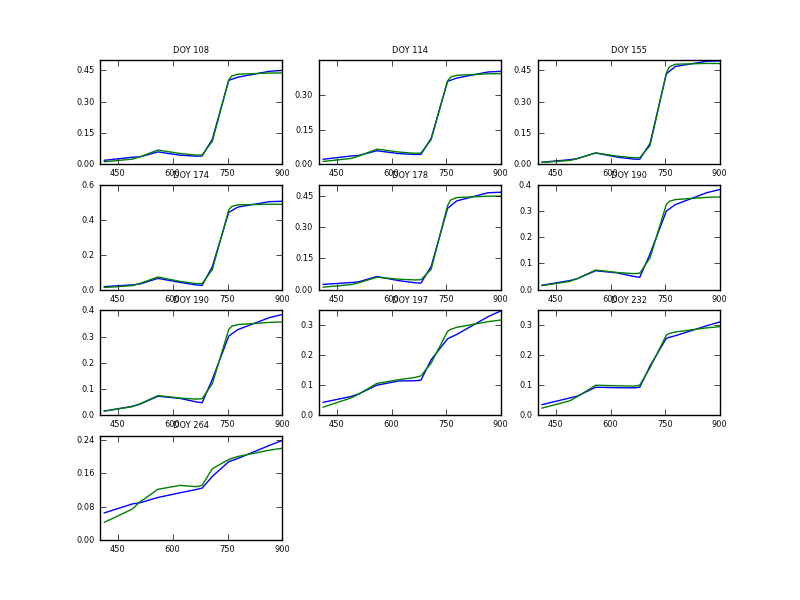

A Spectral Invariant Model
==========================

In the last section, we built a simple base BRDF class, capable of reading andf writing data from ASCII files, with some plotting functyionality.

In this session, we will develop a simple canopy reflectance model, and apply that model to some MERIS observations.

In doing so, we will inherit methods from the brdf class.

A Spectral Invariant Model
--------------------------

A simple, but often quite powerful way of modelling canopy reflectance is to use concepts of spectral invariance. In essence, we consider the impact of structure on the signal. A core structural term we can use is sometimes called the recollision probability, p. This is the probability that a photon, having interacted with a vegetation canopy element, with interact with another canopy element, rather than escaping the medium. So, (1-p) gives the probability that a photon will escape.

The simplest model we can build of this form is:

    r = a omega / ( 1 - p omega) + b soil

Here, r is reflectance, a is a structural term that is essentially an upward escape probability, and omega is the single scattering albedo for a leaf element. The parameter b then is a scaling term for the soil contribution, soil being a typical soil spectrum. This is a very simple model of canopy reflectance, but we will see that it is quite effective at describing spectral reflectance for the wavebands of the `ESA MERIS sensor <http://envisat.esa.int/handbooks/meris/>`_.

::

    import numpy as np
    import brdf
    
    def spectral_invariant(params,drivers):
       '''
       Calculate reflectance using a spectral invariant model
       '''
       a = params[0]
       p = params[1]
       b = params[2]
       omega = drivers[0]
       soil = drivers[1]
       r = a * omega / (1 - p * omega) + b * soil
       return r
    

The file `python/ssalbedo.dat <python/ssalbedo.dat>`_ contains an example function of leaf single scattering albedo. The file `python/soil.dat  <python/soil.dat>`_ contains a typical soil spectrum,

Comparing the model with some observations
-----------------------------------------

::

    omega = np.loadtxt('python/ssalbedo.dat',unpack=True)
    soil = np.loadtxt('python/soil.dat',unpack=True)
    meris = brdf.brdf(ipfile='meris/MERIS_WG_1_C_1.brf')
    meris.plot([omega[0],soil[0],],[omega[1],soil[1]],outfile='meris/omega.png')
    

We have used the brdf class to read in a file `meris/MERIS_WG_1_C_1.brf <meris/MERIS_WG_1_C_1.brf>`_.
Note how we use the plot function from the brdf class we had previously developed, for convenience here.

The leaf single scattering albedo and soil spectrum are plotted above as a function of wavelength (nm). Leaf albedo is high in the near infrared, and low at visible wavelengths. Note that this is just a typical plot for this function. The values associated with a particular leaf vary according to its biochemical constituents.

Let us now pull out the soil and leaf single scattering albedo just for the wavelengths of interest to matching to the MERIS data:

::

    omega_sub = omega[1,np.in1d(omega[0],meris.bands)]
    soil_sub = soil[1,np.in1d(soil[0],meris.bands)]
    meris.plot([meris.bands,meris.bands,meris.bands],[omega_sub,soil_sub,meris.reflectance[:,0]],outfile='meris/omega2.png')
    

For some given set of model parameters, we can plot both some measured spectrum and the modelled values:

::

    meris.plot([meris.bands,meris.bands],[meris.reflectance[:,0],spectral_invariant([0.08,0.8,0.1],[omega_sub,soil_sub])],outfile='meris/omega3.png')
    

Here, we have set a to 0.08 and p to 0.8, with b = 0.1. The match is reasonable as a first guess. A measure of the match between the measured and modelled data is the RMSE normalised by the uncertainty in the data (constant over all wavebands here, but available from meris.err):

::

    def RMSE(params,drivers):
        '''
        Weighted Root MSE 
        '''
        meris = drivers[2]
        whichMeris = drivers[3]
        d = (meris.reflectance[:,whichMeris] - \
    		spectral_invariant(params,drivers))/\
    		meris.err
        RMSE = np.sqrt((d*d).mean())   
        return RMSE
    
    params = [0.08,0.8,0.1]
    drivers = [omega_sub,soil_sub,meris,0,np.arange(len(meris.bands))]
    err = RMSE(params,drivers)
    print err
    

::

    7.55071368076
    

Optimisation
------------

Of course, to find an optimal estimate of the parameters a and p, we need to find the parameter values that give the minumum of the error function.

We can use the various optimisation routines in `scipy.optimize <http://docs.scipy.org/doc/scipy/reference/optimize.html>`_ for this:

::

    import scipy.optimize
    
    drivers = [omega_sub,soil_sub,meris,0]
    
    retval = scipy.optimize.fmin_cg(RMSE,params,args=[drivers])
    print retval
    # now plot with these retrieved parameters
    meris.plot([meris.bands,meris.bands],[meris.reflectance[:,0],spectral_invariant(retval,[omega_sub,soil_sub])],outfile='meris/omega4.png')
    

::

    Optimization terminated successfully.
             Current function value: 0.925628
             Iterations: 58
             Function evaluations: 1103
             Gradient evaluations: 196
    [ 0.05825151  0.79204316  0.09207861]
    

We could look at the model results over all data in the MERIS dataset:

::

    params0 = [0.08,0.8,0.1]
    params = []
    fwd = []
    meas = []
    for i in xrange(meris.nsamples):
        drivers = [omega_sub,soil_sub,meris,i]
        params.append(scipy.optimize.fmin_cg(RMSE,params0,args=[drivers]))
        fwd.append(spectral_invariant(params[-1],[omega_sub,soil_sub]))
        meas.append(meris.reflectance[:,i])
    x = meris.bands
    meas = np.array(meas)
    fwd = np.array(fwd)
    meris.plot([x,x],[meas,fwd],titles=['DOY %d'%i for i in meris.doy],outfile='meris/omega5.png')
    print params
    

::

    Optimization terminated successfully.
             Current function value: 0.925628
             Iterations: 58
             Function evaluations: 1103
             Gradient evaluations: 196
    Optimization terminated successfully.
             Current function value: 1.122273
             Iterations: 141
             Function evaluations: 5933
             Gradient evaluations: 1084
    Optimization terminated successfully.
             Current function value: 1.356215
             Iterations: 80
             Function evaluations: 1978
             Gradient evaluations: 356
    Optimization terminated successfully.
             Current function value: 1.822741
             Iterations: 37
             Function evaluations: 440
             Gradient evaluations: 88
    Warning: Desired error not necessarily achieved due to precision loss
             Current function value: 1.195454
             Iterations: 150
             Function evaluations: 14477
             Gradient evaluations: 2748
    Warning: Desired error not necessarily achieved due to precision loss
             Current function value: 1.396558
             Iterations: 107
             Function evaluations: 1982
             Gradient evaluations: 353
    Optimization terminated successfully.
             Current function value: 1.824248
             Iterations: 56
             Function evaluations: 921
             Gradient evaluations: 178
    Warning: Desired error not necessarily achieved due to precision loss
             Current function value: 1.037347
             Iterations: 60
             Function evaluations: 1058
             Gradient evaluations: 205
    Optimization terminated successfully.
             Current function value: 2.038530
             Iterations: 70
             Function evaluations: 941
             Gradient evaluations: 186
    [array([ 0.05825151,  0.79204316,  0.09207861]), array([ 0.05670423,  0.86196896,  0.05307729]), array([ 0.04910763,  0.89354022,  0.08841601]), array([ 0.07099244,  0.83324506,  0.1075059 ]), array([ 0.11505577,  0.63348184,  0.11771833]), array([ 0.00429126,  0.97539289,  0.21448233]), array([ 0.12133575, -0.33632984,  0.31331276]), array([ 0.14196811, -0.56111059,  0.17777546]), array([ 1.09995911, -7.2936987 ,  0.21630657])]
    

     
We see that the model works very well (in terms of describing the reflectance over the 15 MERIS bands) until around DOY 190, when scenescence starts to become important in the signal. The method can be adapted to deal with this, but is not done here.

Revisiting the code
-------------------

What we have done here is to fit a non linear model to a set of spectral measurements from a satellite. The purpose of this exercise is not to analyse the results, but to understand how to use python to achieve this. If you want to know more about spectral invariants, see e.g.:

* P. Lewis and M. Disney (2007) Spectral invariants and scattering across multiple scales from within-leaf to canopy, Remote Sensing of Environment 109, 196-206.
* D. Huang, Y. Knyazikhin, R.E. Dickinson, M. Rautiainen, P. Stenberg, M. Disney, P. Lewis, A. Cescatti, Y. Tian, W. Verhoef, and R.B. Myneni (2007), Canopy spectral invariants for remote sensing and model applications, Remote Sensing of Environment, 106, 106-122

We used `scipy.optimize.fmin_cg` here to achieve the optimisation, but other choices could be considerd as well. 

The information that we passed to this was:

* the method `RMSE`
* an initial estimate of the parameters, `params`
* some ancillary data, that we called `drivers` and passed as a list.

A lot of the information used here is actually contained in an instance of the class `brdf`. We might consider then, developing a new class that inherits the proprties of the `brdf` class. For example:

::

    from brdf import brdf
    import numpy as np
    import scipy.optimize
    
    def RMSE(params,drivers):
        self = drivers[0]
        which_one = self.which_one
        fwd = self.model(params)
        meas = self.reflectance[:,which_one]
        err = self.err
        d = (meas - fwd)/err
        return np.sqrt((d*d).mean())
    
    class brdf_solve(brdf):
        '''
        A class to read, write, plot and fit a model to brdf data
    
        P. Lewis, UCL 28 November 2011
        '''
        def __init__(self,ipfile=None):
            # make use of brdf init
            brdf.__init__(self,ipfile=ipfile)        
            # but also do anything else we need here
            self.omega = np.loadtxt('python/ssalbedo.dat',unpack=True)
            self.soil = np.loadtxt('python/soil.dat',unpack=True)
     
        def model(self,params):
            '''
            Calculate reflectance using a spectral invariant model
            '''
            a = params[0]
            p = params[1]
            b = params[2]
            try:
                r = a * self.omega_sub / (1 - p * self.omega_sub) \
    			+ b * self.soil_sub
            except:
                self.omega_sub = self.omega[1,\
    			np.in1d(self.omega[0],self.bands)]
                self.soil_sub = self.soil[1,\
                            np.in1d(self.soil[0],self.bands)]
                r = a * self.omega_sub / (1 - p * self.omega_sub) \
                            + b * self.soil_sub
            return r
    
        def solve_one(self,\
    		which_one=0,\
    		params = [0.08,0.8,0.1],\
    		plot=False,plotfile=None):
            '''
            Estimate model parameters for which_one
    
            to plot, set plot=True
            to save plot to file, also set plotfile=filename.png
    
            '''   
            self.which_one = which_one
            drivers = [self]
            retval = scipy.optimize.fmin_cg(RMSE,params,args=[drivers]) 
            fwd = self.model(retval)
            try:
                self.fwd[:,which_one] = fwd
                self.params[:,which_one] = retval
            except:
                self.fwd = self.reflectance*0.
                self.params = np.zeros((len(params),self.nsamples))
                self.fwd[:,which_one] = fwd
                self.params[:,which_one] = retval
            if plot:
                meas = self.reflectance[:,which_one]
                self.plot([self.bands]*2,[meas,fwd],outfile=plotfile)
            return retval
    
        def solve(self,params = [0.08,0.8,0.1],\
                    ofile=None,\
                    fwdfile=None,\
                    plot=False,plotfile=None):
            '''
            Solve for parameter estimate for all samples
    
            set plot = True to plot results
            also set plotfile=filename.png to save file
           
            set fwdfile=filename.dat to save fwd modelled results
    
            set ofile=params.dat to save params to file
            '''
            # do parameter estimation
            for i in xrange(self.nsamples):
                self.solve_one(which_one=i,params=params)
            # write fwd modelled values
            if fwdfile:
                self.write(fwdfile,reflectance=self.fwd)
            # write parameters
            if ofile:
                np.savetxt(ofile,self.params.transpose(),fmt=('%8.3f'))
            if plot:
                self.plot([self.bands]*2,[self.reflectance.transpose()\
    		,self.fwd.transpose()],\
                    titles=['DOY %d'%i for i in self.doy],\
                    outfile=plotfile)
                  
    # try this out now, on a different file
    meris = brdf_solve(ipfile='meris/MERIS_WW_1_A_1.brf')
    meris.solve_one(which_one=0,plot=True,plotfile='meris/omega10.png')
    meris.solve(ofile='meris/params.dat',plot=True,plotfile='meris/omega11.png') 
    

::

    Warning: Maximum number of iterations has been exceeded
             Current function value: 0.912466
             Iterations: 600
             Function evaluations: 54254
             Gradient evaluations: 9920
    Warning: Maximum number of iterations has been exceeded
             Current function value: 0.912466
             Iterations: 600
             Function evaluations: 54254
             Gradient evaluations: 9920
    Warning: Maximum number of iterations has been exceeded
             Current function value: 0.837919
             Iterations: 600
             Function evaluations: 47663
             Gradient evaluations: 8591
    Warning: Maximum number of iterations has been exceeded
             Current function value: 0.907337
             Iterations: 600
             Function evaluations: 98324
             Gradient evaluations: 18453
    Optimization terminated successfully.
             Current function value: 1.248855
             Iterations: 24
             Function evaluations: 379
             Gradient evaluations: 67
    Warning: Desired error not necessarily achieved due to precision loss
             Current function value: 1.482834
             Iterations: 52
             Function evaluations: 1586
             Gradient evaluations: 300
    Warning: Desired error not necessarily achieved due to precision loss
             Current function value: 1.672006
             Iterations: 104
             Function evaluations: 7328
             Gradient evaluations: 1380
    Optimization terminated successfully.
             Current function value: 1.683561
             Iterations: 59
             Function evaluations: 2108
             Gradient evaluations: 397
    Optimization terminated successfully.
             Current function value: 1.765175
             Iterations: 36
             Function evaluations: 436
             Gradient evaluations: 85
    Warning: Desired error not necessarily achieved due to precision loss
             Current function value: 0.974306
             Iterations: 95
             Function evaluations: 5866
             Gradient evaluations: 1100
    Optimization terminated successfully.
             Current function value: 1.397123
             Iterations: 94
             Function evaluations: 1356
             Gradient evaluations: 269
    

.. literalinclude:: meris/params.dat

::

    help(meris)
    

::

    Help on instance of brdf_solve in module __builtin__:
    
    class brdf_solve(brdf.brdf)
     |  A class to read, write, plot and fit a model to brdf data
     |  
     |  P. Lewis, UCL 28 November 2011
     |  
     |  Methods defined here:
     |  
     |  __init__(self, ipfile=None)
     |  
     |  model(self, params)
     |      Calculate reflectance using a spectral invariant model
     |  
     |  solve(self, params=[0.08, 0.8, 0.1], ofile=None, fwdfile=None, plot=False, plotfile=None)
     |      Solve for parameter estimate for all samples
     |      
     |      set plot = True to plot results
     |      also set plotfile=filename.png to save file
     |      
     |      set fwdfile=filename.dat to save fwd modelled results
     |      
     |      set ofile=params.dat to save params to file
     |  
     |  solve_one(self, which_one=0, params=[0.08, 0.8, 0.1], plot=False, plotfile=None)
     |      Estimate model parameters for which_one
     |      
     |      to plot, set plot=True
     |      to save plot to file, also set plotfile=filename.png
     |  
     |  ----------------------------------------------------------------------
     |  Methods inherited from brdf.brdf:
     |  
     |  plot(self, x, y, titles=None, outfile=None)
     |      Plot y as fn of x
     |      
     |      Both x and y can be lists, in which case we plot multiple datasets
     |  
     |  plot_doy(self, outfile=None)
     |      Plot of reflectance as a function of DOY for each waveband
     |  
     |  plot_spectral(self, outfile=None)
     |      Spectral plot of reflectance for each DOY
     |  
     |  read(self, filename)
     |      Read data from file and store reflectance
     |      and associated control data
     |  
     |  write(self, filename, reflectance=None)
     |      Write BRDF data to file.
     |      
     |      The reflectance data that we want to write to the files can
     |      be passed to this method, to override reflectance
    
    

 
Summary
-------
We have seen in this section how to interface a model and measurements to an optimisation routine. The core of this is simply a call to the optimisation method (in e.g. scipy.optimize). You will normally need to pass it the name of a method for calculating the cost of mismatch (i.e. what it is you want to minimise), an initial estimate of the parameters (the result you get may be sensitive to this), and some other information (e.g. drivers). 
There are also generally customisable controls (e.g. maximum number of iterations). There is nothing complicated in interfacing to these codes, you simply need to think about what information you are going to need to calculate the cost function (RMSE here) and make sure that the relevant information is either a parameter or that you pass it through as a driver.

Throughout this session, we have seen how the brdf class that we previously defined is helpful for doing operations on this type of data. 

In the latter part of this session, we have built a new class, brdf_solve that is derived from the brdf class. This means that it inherits its methods, so we can add new functionality on top of the core (read, write, plot) that we already have. In this case, we add interfaces to allow for parameter estimation, the saving of parameter files, and plotting both the original (measrued) data and that which we forward model here.

Assessed Exercise: Part 3 (of 3)
--------------------------------

Your third task is:

* to apply an optimal estimation framework within python to calibrate the parameters of the hydrological (snow) mode you have built in a previous exercise.

You *must* quantify the goodness of fit between your measured flow data and that produced by your model.

If you wish to go beyond the basic requirements for this part of the practical, probably the most fruitful thing to do would be to attempt to validate the model and the parameters that you have obtained by applying them to data from a year that is independent of that used for the calibration (i.e. not 2005).

Advice of the required structure of the report and other advice on writing up will be given in the next session 'writing up'.

