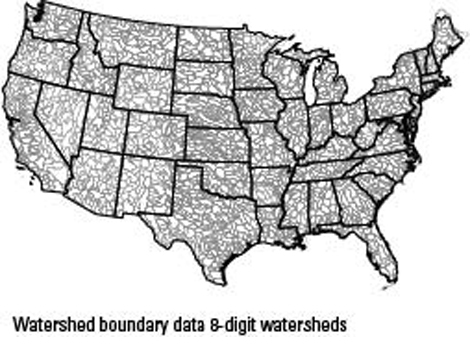
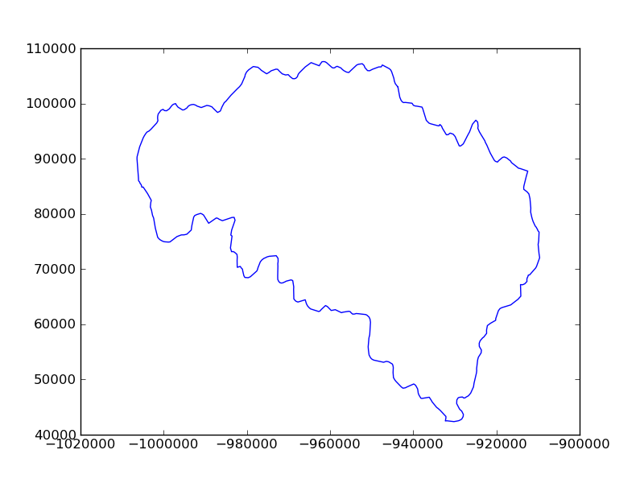
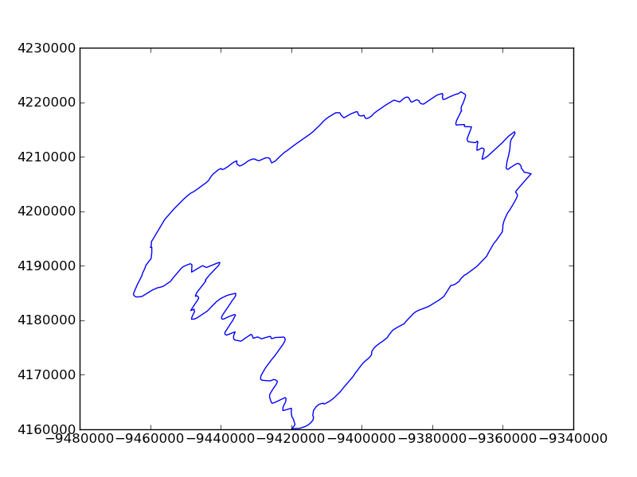
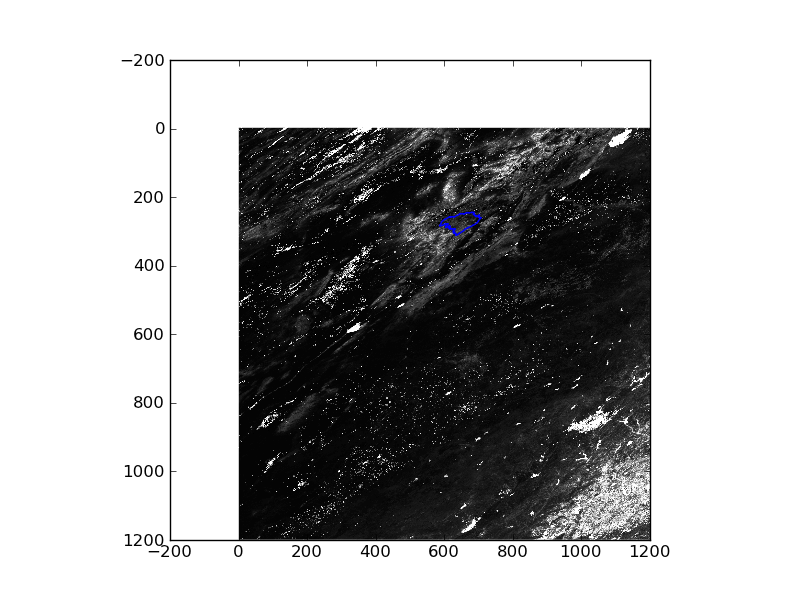
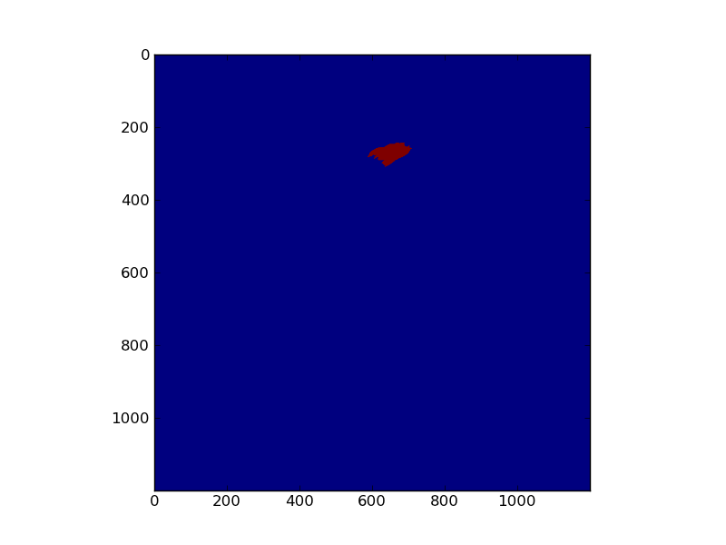
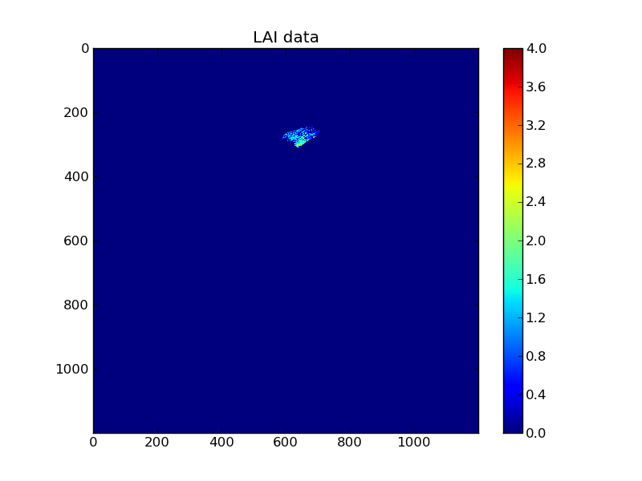
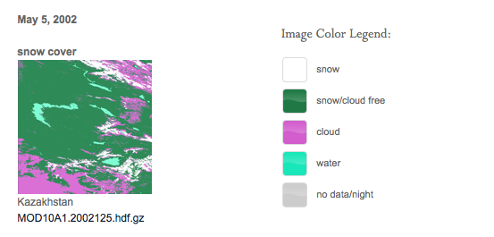

Apply a vector mask to a Raster image
=====================================

In this session, we will learn to read a vector dataset from an ESRI shapefile, apply a projection transformation of the data to a raster, and then use the vector to mask the raster dataset. This is a very typical task in remote sensing and other image processing.

Read an ESRI shapefile
----------------------

An `ESRI shapefile <http://www.google.co.uk/url?sa=t&rct=j&q=esri%20shapefile&source=web&cd=2&ved=0CD0QFjAB&url=http%3A%2F%2Fwww.esri.com%2Flibrary%2Fwhitepapers%2Fpdfs%2Fshapefile.pdf&ei=fdKmTvSHBJOHhQePvfiWDg&usg=AFQjCNHp9v_VCrbagYu23yPhKgqEO9KX8Q&sig2=iJn8qZND-gtNIBZ_AxBeZw&cad=rja>`_
is a widely used vector file format.

A good example of this is extracting data within a hydrological catchment. These data might typically come as `ESRI shapefiles <http://en.wikipedia.org/wiki/Shapefile>`_ or other vector formats, but we will concentrate on the shapefile here. There tends to be variable quality among different databases, but a reliable source for catchment data the USA is the `USGS <http://water.usgs.gov/GIS/huc.html>`_. One set of catchments in the tile we have is the Rio Grande headwaters, which we can `see <http://water.usgs.gov/GIS/huc_rdb.html>`_ has a HUC 8-digit code of 13010001.  The full dataset is easily found from the `USGS <huc250k_shp.zip>`_.
Literature and associated data concerning this area `can be found here <http://water.usgs.gov/lookup/getwatershed?13010001>`_.
Associated `GIS data are here <http://water.usgs.gov/lookup/getgislist?type=huc&value=13010001>`_, including the `watershed boundary data <http://water.usgs.gov/GIS/dsdl/ds573_wbdhuc8.ZIP>`_:

Data more specific to our particular catchment of interest `can be found on the Rio Grande Data Project pages <http://txpub.usgs.gov/USACE/resources.aspx>`_.

You should download the `file Hydrologic_Units.zip <http://txpub.usgs.gov/USACE/data/water_resources/Hydrologic_Units.zip>`_::

    
    berlin% mkdir hucData
    berlin% cd hucData
    berlin% curl http://txpub.usgs.gov/USACE/data/water_resources/Hydrologic_Units.zip -o Hydrologic_Units.zip
    berlin% unzip Hydrologic_Units.zip
    Archive:  Hydrologic_Units.zip
      ...
      inflating: Hydrologic_Units/HUC_Polygons.shp
      ...

We can use the ``gdal`` utility ``ogrinfo`` to explore the data within the shapefile::

    berlin% ogrinfo Hydrologic_Units/HUC_Polygons.shp HUC_Polygon | less
    OGRFeature(HUC_Polygon):2
      HUC (Integer) = 13010001
      REG_NAME (String) = Rio Grande Region
      SUB_NAME (String) = Rio Grande Headwaters
      ACC_NAME (String) = Rio Grande Headwaters
      CAT_NAME (String) = Rio Grande Headwaters. Colorado.
      HUC2 (Integer) = 13
      HUC4 (Integer) = 1301
      HUC6 (Integer) = 130100
      REG (Integer) = 13
      SUB (Integer) = 1301
      ACC (Integer) = 130100
      CAT (Integer) = 13010001
      CAT_NUM (String) = 13010001
      ...

Another way to check which data entry we are interested in would be to use 
dbflib to search the entries until we find the code 13010001:

::

    import dbflib
    import numpy as np
    
    file = 'Hydrologic_Units/HUC_Polygons.shp'
    thishuc = 13010001
    dbf = dbflib.open(file)
    rec_count  = dbf.record_count()
    thisrecord_n = -1
    thisrecord = ""
    for i in np.arange(rec_count):
        this = dbf.read_record(i)
        if this['HUC'] == thishuc:
            thisrecord_n = i
            thisrecord = this.copy()
            break
    dbf.close()
    print thisrecord_n,thisrecord        
    

::

    2 {'ACC': 130100, 'Shape_Area': 3458016895.23, 'SUB_NAME': 'Rio Grande Headwaters', 'SUB': 1301, 'CAT_NAME': 'Rio Grande Headwaters. Colorado.', 'HUC': 13010001, 'ACC_NAME': 'Rio Grande Headwaters', 'REG_NAME': 'Rio Grande Region', 'CAT': 13010001, 'CAT_NUM': '13010001', 'Shape_Leng': 313605.664094, 'HUC2': 13, 'HUC4': 1301, 'REG': 13, 'HUC6': 130100}
    

So we learn that the entry we want is record 2.

We now wish to open the shapefile and read the core information:

::

    import ogr
    
    thisrecord_n = 2
    file = 'Hydrologic_Units/HUC_Polygons.shp'
    orig_data_source = ogr.Open(file)
    source_ds = ogr.GetDriverByName("Memory").CopyDataSource(orig_data_source, "")
    source_layer = source_ds.GetLayer(0)
    source_srs = source_layer.GetSpatialRef()
    wkt = source_srs.ExportToWkt()
    print wkt
    print type(wkt)
    

::

    PROJCS["USA_Contiguous_Albers_Equal_Area_Conic",GEOGCS["GCS_North_American_1983",DATUM["North_American_Datum_1983",SPHEROID["GRS_1980",6378137.0,298.257222101]],PRIMEM["Greenwich",0.0],UNIT["Degree",0.0174532925199433]],PROJECTION["Albers_Conic_Equal_Area"],PARAMETER["False_Easting",0.0],PARAMETER["False_Northing",0.0],PARAMETER["longitude_of_center",-96.0],PARAMETER["Standard_Parallel_1",29.5],PARAMETER["Standard_Parallel_2",45.5],PARAMETER["latitude_of_center",37.5],UNIT["Meter",1.0]]
    <type 'str'>
    

The 'wicket' data that we have extracted from the shapefile gives a full definition of the projection as a string.

Now we can read the vector data:

::

    import numpy as np
    
    poly = source_layer.GetFeature(thisrecord_n)
    # dump the data, just to check the first time we look at it
    poly.DumpReadable()
    
    geom = poly.GetGeometryRef()
    pts = geom.GetGeometryRef(0)
    points = []
    for p in range(pts.GetPointCount()):
        points.append((pts.GetX(p), pts.GetY(p)))
    
    pnts = np.array(points).transpose()
    print points[:10]
    
    extent = source_layer.GetExtent()
    print extent
    
    import pylab
    pylab.plot(pnts[0],pnts[1])
    pylab.show()
    

::

    [(-943684.8506000005, 102993.52109999955), (-943232.8454, 101135.40729999915), (-942909.9633000009, 100557.40750000067), (-942620.0738999993, 100286.17909999937), (-942321.4146999996, 100167.16420000046), (-941913.0398999993, 100194.39110000059), (-940292.6042999998, 100049.36680000089), (-939958.3883999996, 99673.76579999924), (-939507.5402000006, 99546.06959999911), (-939202.6513, 99528.02209999971)]
    (-1207861.1937000006, -115932.91950000077, -1295788.3854, 152769.25439999998)
    

So ... we now have access to the polygon data for the catchment boundary and we want to make a 'mask' in the space of the MODIS data.
This means that we need access to the MODIS projection reference data and we then transform the polygon that we pull out of the shapefile:

::

    import osr,gdal
    
    data_layer = 'MOD_Grid_MOD15A2:Lai_1km'
    
    modis_file = 'MCD15A2.A2011185.h09v05.005.2011213154534.hdf'
    fname = 'HDF4_EOS:EOS_GRID:"%s":%s'%(modis_file,data_layer)
    raster = gdal.Open(fname)
    # get the wicket
    modisWKT = raster.GetProjectionRef()
    print modisWKT
    
    oSRS = osr.SpatialReference ()
    oSRSop = osr.SpatialReference ()
    
    
    oSRSop.ImportFromWkt(modisWKT)
    # wkt from above, is the wicket from the shapefile
    oSRS.ImportFromWkt(wkt)
    # now make sure we have the shapefile geom
    geom = poly.GetGeometryRef()
    pts = geom.GetGeometryRef(0)
    # pts is the polygon of interest
    pts.AssignSpatialReference(oSRS)
    # so transform it to the MODIS geometry
    pts.TransformTo(oSRSop)
    
    # extract and plot the transformed data
    points = []
    for p in range(pts.GetPointCount()):
        points.append((pts.GetX(p), pts.GetY(p)))
    pnts = np.array(points).transpose()
    import pylab
    pylab.plot(pnts[0],pnts[1])
    pylab.show()
    
    

::

    PROJCS["unnamed",GEOGCS["Unknown datum based upon the custom spheroid",DATUM["Not specified (based on custom spheroid)",SPHEROID["Custom spheroid",6371007.181,0]],PRIMEM["Greenwich",0],UNIT["degree",0.0174532925199433]],PROJECTION["Sinusoidal"],PARAMETER["longitude_of_center",0],PARAMETER["false_easting",0],PARAMETER["false_northing",0],UNIT["Meter",1]]
    

 
So ... now we have the polygon data as points for the MODIS (SIN) projection, and we can proceed to make a mask. 

::

    def world2Pixel(geoMatrix, x, y):
      """
      Uses a gdal geomatrix (gdal.GetGeoTransform()) to calculate
      the pixel location of a geospatial coordinate 
      """
      ulX = geoMatrix[0]
      ulY = geoMatrix[3]
      xDist = geoMatrix[1]
      yDist = geoMatrix[5]
      rtnX = geoMatrix[2]
      rtnY = geoMatrix[4]
      pixel = np.round((x - ulX) / xDist).astype(np.int)
      line = np.round((ulY - y) / xDist).astype(np.int)
      return (pixel, line)
    
    geo_t = raster.GetGeoTransform()
    print geo_t
    
    pixel, line = world2Pixel(geo_t,pnts[0],pnts[1])
    
    import pylab
    pylab.imshow(raster.ReadAsArray(),vmin=1,vmax=60,cmap=pylab.cm.gray)
    pylab.plot(pixel, line)
    pylab.show()
    
    

::

    (-10007554.677, 926.625433055833, 0.0, 4447802.078667, 0.0, -926.6254330558334)
    

So, now we have two reconciled datasets and need to make a raster mask from the vector data.

::

    # after http://geospatialpython.com/2011/02/clip-raster-using-shapefile.html
    import Image,ImageDraw
    # This function will convert the rasterized clipper shapefile 
    # to a mask for use within GDAL.    
    def imageToArray(i):
        """
        Converts a Python Imaging Library array to a 
        numpy array.
        """
        a=np.fromstring(i.tostring(),'b')
        a.shape=i.im.size[1], i.im.size[0]
        return a
    
    rasterPoly = Image.new("L", (raster.RasterXSize, raster.RasterYSize),1)
    rasterize = ImageDraw.Draw(rasterPoly)
    listdata = [(pixel[i],line[i]) for i in xrange(len(pixel))]
    rasterize.polygon(listdata,0)
    mask = 1 - imageToArray(rasterPoly)   
    
    pylab.imshow(mask)
    pylab.show()
    
    

So, *finally* we have a raster mask with value 1 where we want to allow data through, so we can try another file and process this:

::

    import gdalnumeric
    
    filename = 'MCD15A2.A2011185.h09v05.005.2011213154534.hdf'
    ds = gdal.Open(filename)
    sds_md = ds.GetMetadata('SUBDATASETS')
    datakeys = {}
    datasets = ['SUBDATASET_2','SUBDATASET_3','SUBDATASET_3','SUBDATASET_4']
    datanames = ['Lai_1km','LaiStdDev_1km','FparLai_QC','FparExtra_QC']
    for (j,i) in enumerate(datasets):
        this = {}
        this['name'] = sds_md[i + '_NAME']
        this['description'] = sds_md[i + '_DESC']
        this['data'] = gdalnumeric.LoadFile(this['name'])
        datakeys[datanames[j]] = this.copy()
    
    lai = datakeys['Lai_1km']['data'] * 0.1
    lai_sd = datakeys['LaiStdDev_1km']['data'] * 0.1
    qc = datakeys['FparLai_QC']['data']
    mask_qa = np.zeros_like(lai).astype(bool)
    okvalues = [0,2]
    for i in okvalues:
        mask_qa[np.where(qc == i)] = True
    nlai = lai.copy()
    nlai[True - mask_qa] = 0.0
    nlai *= mask
    
    fig = pylab.figure()
    ax = fig.add_subplot(111)
    cax = ax.imshow(nlai, interpolation='nearest')
    cbar = fig.colorbar(cax)
    ax.set_title('LAI data')
    pylab.show()
    
    
    

Exercise
--------

If we look at `the code we have developed here <python/vectorMask.py>`_, it is logical and takes us through the steps that we need to go through, but it is a little 'messy'.

The first exercise is to tidy the code up, and try to make it more generic, using functions/methods as appropriate.
Make sure the code is well commented.

Assessed Exercise: Part 1 (of 3)
-------------------------------

It is important that you complete *this* exercise, as you will need to make use of the code and results in the work you submit for assessment for this course.

The task you must complete is to produce a dataset of the proportion of HUC catchment 13010001 that is covered by snow for the year 2005. The dataset you produce must be *for every day* over the year.

You should aim to complete this task by the end of Reading Week. After Reading week, you will be given fuller instructions on how to write this up as part of your submission, but you can expect to have to submit code as well as results, so you should take care to document your code carefully.

You **must** work individually on this task. If you do not, it will be treated as plagiarism. By reading these instructions for this exercise, we assume that you are aware of the UCL rules on plagiarism. You can find more information on this matter in your student handbook. If in doubt about what might constitute plagiarism, ask one of the course convenors.

Hints and Caveats
~~~~~~~~~~~~~~~~~
* You would probably want to use a daily snow product for this task, so make sure you know what that is.
* You will notice from the figure above that there will be areas of each image for which you have no information. You will need to decide what to do about that. The simplest thing might be to produce a mean snow cover over what samples are available, but there are certainly **much** better ways of filtering these 'missing values'. 
* You will notice that if you use MODIS data, you have access to both data from Terra (MOD10A) and Aqua (MYD10A), which potentially gives you two samples per day.
* Whilst you only *need* to produce an average daily value for the catchment, there might be some value in trying to estimate snow presence/absence *for each pixel* in the catchment (e.g. so you could do spetially explicit modelling with such data). I stress that this is not strictly necessary, but would be an interesting thing to do if you feel able.

